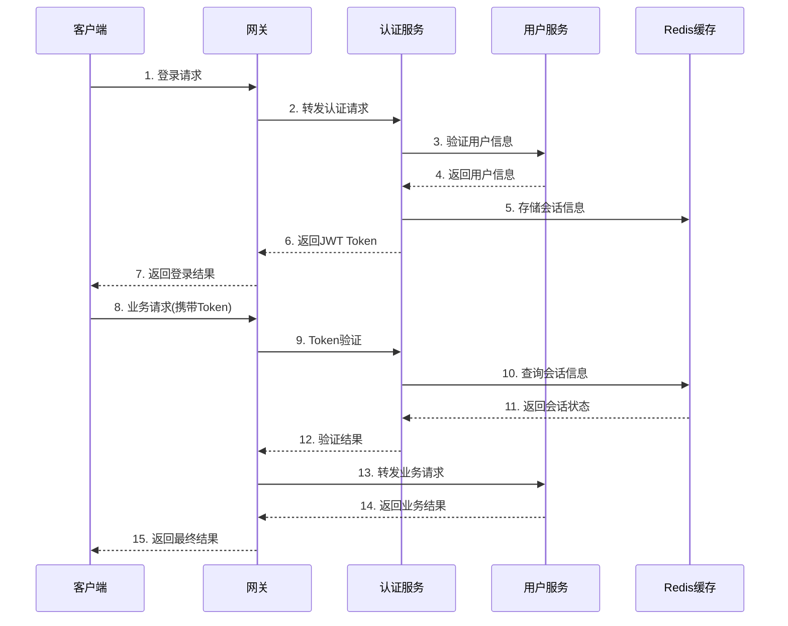

# 用户模块系统架构设计文档

## 一、架构概述

### 1.1 设计原则

- **高可用性**：采用微服务架构，支持水平扩展和故障隔离
- **高性能**：使用缓存机制和数据库优化，确保快速响应
- **安全性**：多层安全防护，数据加密和权限控制
- **可扩展性**：模块化设计，便于功能扩展和维护
- **一致性**：统一的接口规范和数据格式

### 1.2 技术栈选型

| 技术分层 | 技术选型 | 版本 | 说明 |
|----------|----------|------|------|
| 开发语言 | Java | 17 | 主要开发语言 |
| 框架 | Spring Boot | 2.7.x | 微服务框架 |
| 微服务 | Spring Cloud Alibaba | 2021.x | 微服务治理 |
| 数据库 | MySQL | 8.0 | 主数据库 |
| 持久层框架 | MyBatis Plus | 3.5.x | ORM框架，简化数据访问 |
| 缓存 | Redis | 6.2 | 分布式缓存 |
| 消息队列 | RabbitMQ | 3.11 | 异步消息处理 |
| 搜索引擎 | Elasticsearch | 7.14 | 用户搜索和日志分析 |
| 容器化 | Docker | 20.x | 容器化部署 |
| 编排工具 | Kubernetes | 1.24 | 容器编排 |

### 1.3 架构分层

```
┌─────────────────────────────────────────────────────────────┐
│                        客户端层                              │
│  Web端(Vue3) │ 移动端(Flutter) │ 小程序 │ 第三方系统        │
└─────────────────────────────────────────────────────────────┘
                                │
┌─────────────────────────────────────────────────────────────┐
│                        网关层                                │
│              Spring Cloud Gateway                           │
│        (路由、限流、认证、监控)                              │
└─────────────────────────────────────────────────────────────┘
                                │
┌─────────────────────────────────────────────────────────────┐
│                        服务层                                │
│  用户服务 │ 认证服务 │ 通知服务 │ 文件服务 │ 其他业务服务    │
└─────────────────────────────────────────────────────────────┘
                                │
┌─────────────────────────────────────────────────────────────┐
│                        数据层                                │
│    MySQL    │    Redis    │  RabbitMQ  │ Elasticsearch     │
└─────────────────────────────────────────────────────────────┘
```

## 二、服务架构设计

### 2.1 用户服务架构 (msc-user)

#### 2.1.1 服务职责范围

**统一用户服务 (msc-user) 职责：**
- 用户基础信息管理
- 用户注册登录
- 个人资料维护
- 收货地址管理
- JWT Token管理
- 用户认证验证
- 权限控制
- 第三方登录集成
- 会员等级管理
- 积分获取和消费
- 会员权益计算
- 积分明细记录
- 短信通知发送
- 邮件通知发送
- APP推送通知
- 消息模板管理

#### 2.1.2 模块化架构设计

**整体模块结构：**
```
msc-user/
├── src/main/java/com/multishop/user/
│   ├── controller/              # 控制层
│   │   ├── user/               # 用户基础功能
│   │   │   ├── UserController
│   │   │   ├── ProfileController
│   │   │   └── AddressController
│   │   ├── auth/               # 认证授权功能
│   │   │   ├── AuthController
│   │   │   ├── TokenController
│   │   │   └── OAuthController
│   │   ├── member/             # 会员积分功能
│   │   │   ├── MemberController
│   │   │   └── PointsController
│   │   └── notification/       # 消息通知功能
│   │       └── NotificationController
│   ├── service/                # 服务层
│   │   ├── user/               # 用户服务模块
│   │   │   ├── UserService
│   │   │   ├── ProfileService
│   │   │   └── AddressService
│   │   ├── auth/               # 认证服务模块
│   │   │   ├── AuthService
│   │   │   ├── TokenService
│   │   │   ├── JwtService
│   │   │   └── OAuthService
│   │   ├── member/             # 会员服务模块
│   │   │   ├── MemberService
│   │   │   ├── PointsService
│   │   │   └── MemberLevelService
│   │   └── notification/       # 通知服务模块
│   │       ├── SmsService
│   │       ├── EmailService
│   │       ├── PushService
│   │       └── TemplateService
│   ├── mapper/                 # 数据访问层 (MyBatis Plus)
│   │   ├── user/
│   │   │   ├── UserMapper
│   │   │   ├── ProfileMapper
│   │   │   └── AddressMapper
│   │   ├── auth/
│   │   │   └── UserTokenMapper
│   │   ├── member/
│   │   │   ├── MemberMapper
│   │   │   └── PointsLogMapper
│   │   └── notification/
│   │       └── NotificationLogMapper
│   ├── entity/                 # 实体层
│   │   ├── user/
│   │   │   ├── User
│   │   │   ├── UserProfile
│   │   │   └── UserAddress
│   │   ├── auth/
│   │   │   └── UserToken
│   │   ├── member/
│   │   │   ├── Member
│   │   │   ├── MemberLevel
│   │   │   └── PointsLog
│   │   └── notification/
│   │       ├── NotificationTemplate
│   │       └── NotificationLog
│   ├── dto/                    # 数据传输对象
│   │   ├── request/
│   │   │   ├── user/
│   │   │   ├── auth/
│   │   │   ├── member/
│   │   │   └── notification/
│   │   └── response/
│   │       ├── user/
│   │       ├── auth/
│   │       ├── member/
│   │       └── notification/
│   ├── security/               # 安全配置
│   │   ├── JwtAuthenticationFilter
│   │   ├── SecurityConfig
│   │   └── PasswordEncoder
│   ├── integration/            # 第三方集成
│   │   ├── oauth/
│   │   │   ├── WechatOAuthClient
│   │   │   └── AlipayOAuthClient
│   │   └── notification/
│   │       ├── SmsProvider
│   │       ├── EmailProvider
│   │       └── PushProvider
│   ├── listener/               # 消息监听器
│   │   ├── UserRegistrationListener
│   │   ├── OrderNotificationListener
│   │   └── SystemNotificationListener
│   ├── scheduler/              # 定时任务
│   │   └── MemberLevelUpdateScheduler
│   ├── config/                 # 配置类
│   │   ├── RedisConfig
│   │   ├── RabbitMQConfig
│   │   └── SecurityConfig
│   └── common/                 # 公共组件
│       ├── constants/
│       ├── enums/
│       ├── exception/
│       └── utils/
└── src/main/resources/
    ├── mapper/                 # MyBatis XML映射文件
    ├── application.yml
    └── logback-spring.xml
```

#### 2.1.3 模块间协作示例

**用户注册流程中的模块协作：**
```java
@Service
@Transactional
public class UserRegistrationService {
    
    @Autowired
    private UserService userService;
    
    @Autowired
    private MemberService memberService;
    
    @Autowired
    private NotificationService notificationService;
    
    @Autowired
    private AuthService authService;
    
    public UserRegistrationResponse registerUser(UserRegistrationRequest request) {
        // 1. 创建用户基础信息
        User user = userService.createUser(request);
        
        // 2. 初始化会员信息
        memberService.initMember(user.getId());
        
        // 3. 生成认证Token
        String token = authService.generateToken(user);
        
        // 4. 发送欢迎通知（异步）
        notificationService.sendWelcomeNotification(user);
        
        return UserRegistrationResponse.builder()
            .userId(user.getId())
            .token(token)
            .build();
    }
}

@Component
@RabbitListener(queues = "user.registration.queue")
public class UserRegistrationListener {
    
    @Autowired
    private NotificationService notificationService;
    
    @RabbitHandler
    public void handleUserRegistration(UserRegistrationEvent event) {
        // 发送欢迎短信
        notificationService.sendWelcomeSms(event.getUserId(), event.getPhone());
        
        // 发送欢迎邮件
        notificationService.sendWelcomeEmail(event.getUserId(), event.getEmail());
    }
}
```

### 2.2 模块间通信与协作

#### 2.2.1 模块间直接调用
由于采用单一服务架构，各功能模块之间通过直接的方法调用进行通信，简化了系统复杂度：

```java
// 模块间直接调用示例
@Service
public class UserBusinessService {
    
    @Autowired
    private UserService userService;           // 用户模块
    
    @Autowired
    private AuthService authService;           // 认证模块
    
    @Autowired
    private MemberService memberService;       // 会员模块
    
    @Autowired
    private NotificationService notificationService; // 通知模块
    
    @Transactional
    public UserLoginResponse login(UserLoginRequest request) {
        // 1. 用户认证
        User user = authService.authenticate(request.getUsername(), request.getPassword());
        
        // 2. 更新登录信息
        userService.updateLastLoginTime(user.getId());
        
        // 3. 获取会员信息
        Member member = memberService.getMemberByUserId(user.getId());
        
        // 4. 发送登录通知（异步）
        notificationService.sendLoginNotification(user);
        
        // 5. 生成Token
        String token = authService.generateToken(user);
        
        return UserLoginResponse.builder()
            .user(user)
            .member(member)
            .token(token)
            .build();
    }
}
```

#### 2.2.2 事件驱动架构
对于需要解耦的业务场景，使用Spring Events和RabbitMQ实现事件驱动：

```java
// 事件发布
@Service
public class UserService {
    
    @Autowired
    private ApplicationEventPublisher eventPublisher;
    
    @Autowired
    private RabbitTemplate rabbitTemplate;
    
    public User createUser(UserCreateRequest request) {
        User user = // 创建用户逻辑
        
        // 发布本地事件
        eventPublisher.publishEvent(new UserCreatedEvent(user));
        
        // 发布消息队列事件（跨服务通信）
        rabbitTemplate.convertAndSend("user.exchange", "user.created", 
            new UserCreatedMessage(user.getId(), user.getEmail()));
        
        return user;
    }
}

// 本地事件监听
@Component
public class UserEventListener {
    
    @Autowired
    private MemberService memberService;
    
    @Autowired
    private NotificationService notificationService;
    
    @EventListener
    @Async
    public void handleUserCreated(UserCreatedEvent event) {
        User user = event.getUser();
        
        // 初始化会员信息
        memberService.initMember(user.getId());
        
        // 发送欢迎通知
        notificationService.sendWelcomeNotification(user);
    }
}

// 消息队列监听（处理外部系统事件）
@Component
@RabbitListener(queues = "order.user.queue")
public class OrderEventListener {
    
    @Autowired
    private MemberService memberService;
    
    @RabbitHandler
    public void handleOrderCompleted(OrderCompletedEvent event) {
        // 订单完成后增加积分
        memberService.addPoints(event.getUserId(), event.getOrderAmount());
    }
}
```

### 2.3 数据一致性

#### 2.3.1 本地事务管理
由于采用单一服务架构，大部分业务操作可以通过本地事务保证一致性：

```java
@Service
@Transactional
public class UserRegistrationService {
    
    public UserRegistrationResponse registerUser(UserRegistrationRequest request) {
        try {
            // 1. 创建用户基础信息
            User user = userService.createUser(request);
            
            // 2. 初始化用户资料
            userService.createUserProfile(user.getId(), request.getProfile());
            
            // 3. 初始化会员信息
            memberService.initMember(user.getId());
            
            // 4. 创建默认地址（如果提供）
            if (request.getAddress() != null) {
                userService.createUserAddress(user.getId(), request.getAddress());
            }
            
            // 5. 发送异步通知（事务提交后执行）
            TransactionSynchronizationManager.registerSynchronization(
                new TransactionSynchronization() {
                    @Override
                    public void afterCommit() {
                        notificationService.sendWelcomeNotification(user);
                    }
                }
            );
            
            return UserRegistrationResponse.success(user);
            
        } catch (Exception e) {
            // 事务自动回滚
            log.error("用户注册失败", e);
            throw new UserRegistrationException("用户注册失败", e);
        }
    }
}
```

#### 2.3.2 缓存一致性
```java
// 缓存更新策略
@Service
public class UserCacheService {
    
    @Autowired
    private RedisTemplate<String, Object> redisTemplate;
    
    @Autowired
    private RabbitTemplate rabbitTemplate;
    
    @CacheEvict(value = "user", key = "#userId")
    public void updateUserProfile(Long userId, UserProfile profile) {
        // 1. 更新数据库
        userMapper.updateProfile(userId, profile);
        
        // 2. 清除相关缓存
        String userKey = String.format(CacheKeys.USER_INFO, userId);
        String permissionKey = String.format(CacheKeys.USER_PERMISSION, userId);
        
        redisTemplate.delete(Arrays.asList(userKey, permissionKey));
        
        // 3. 发送缓存失效消息（通知其他服务）
        rabbitTemplate.convertAndSend("cache.exchange", "cache.invalidation", 
            new CacheInvalidationEvent(userId, "user"));
    }
    
    @Cacheable(value = "user", key = "#userId", unless = "#result == null")
    public User getUserById(Long userId) {
        return userMapper.selectById(userId);
    }
}
```

## 三、技术架构设计

### 3.1 缓存架构

#### 3.1.1 多级缓存策略

```
┌─────────────────┐    ┌─────────────────┐    ┌─────────────────┐
│   本地缓存       │    │   分布式缓存     │    │     数据库       │
│   (Caffeine)    │    │    (Redis)      │    │    (MySQL)      │
│   - 热点数据     │    │   - 用户信息     │    │   - 持久化数据   │
│   - 1分钟TTL    │    │   - 30分钟TTL   │    │   - 主从架构     │
└─────────────────┘    └─────────────────┘    └─────────────────┘
```

#### 3.1.2 缓存Key设计规范

```java
// 缓存Key命名规范
public class CacheKeys {
    // 用户基础信息: user:info:{userId}
    public static final String USER_INFO = "user:info:%d";
    
    // 用户权限信息: user:permission:{userId}
    public static final String USER_PERMISSION = "user:permission:%d";
    
    // 用户会话信息: user:session:{token}
    public static final String USER_SESSION = "user:session:%s";
    
    // 验证码: user:captcha:{phone}
    public static final String USER_CAPTCHA = "user:captcha:%s";
}
```

### 3.2 安全架构

#### 3.2.1 认证流程



#### 3.2.2 权限控制模型

```java
// RBAC权限模型
@Entity
public class Role {
    private Long id;
    private String roleName;
    private String roleCode;
    private List<Permission> permissions;
}

@Entity
public class Permission {
    private Long id;
    private String permissionName;
    private String permissionCode;
    private String resourceUrl;
}

@Entity
public class UserRole {
    private Long userId;
    private Long roleId;
    private Date createTime;
}
```

### 3.3 监控架构

#### 3.3.1 监控指标

| 监控类型 | 监控指标 | 告警阈值 | 处理方式 |
|----------|----------|----------|----------|
| 应用监控 | QPS | >1000/s | 自动扩容 |
| 应用监控 | 响应时间 | >2s | 告警通知 |
| 应用监控 | 错误率 | >1% | 立即告警 |
| 系统监控 | CPU使用率 | >80% | 自动扩容 |
| 系统监控 | 内存使用率 | >85% | 告警通知 |
| 数据库监控 | 连接数 | >80% | 告警通知 |
| 缓存监控 | 命中率 | <90% | 优化缓存 |

#### 3.3.2 日志架构

```
应用日志 → Logback → Kafka → Elasticsearch → Kibana
                                    ↓
                              日志分析和告警
```

## 四、数据架构设计

### 4.1 数据库架构

#### 4.1.1 主从架构

```
┌─────────────────┐    ┌─────────────────┐
│   主数据库       │    │   从数据库1      │
│   (Master)      │───▶│   (Slave1)      │
│   - 写操作       │    │   - 读操作       │
│   - 主要读操作   │    │   - 备份恢复     │
└─────────────────┘    └─────────────────┘
         │                       │
         │              ┌─────────────────┐
         └─────────────▶│   从数据库2      │
                        │   (Slave2)      │
                        │   - 读操作       │
                        │   - 数据分析     │
                        └─────────────────┘
```

#### 4.1.2 分库分表策略

```java
// 用户表分表策略
@TableName("user")
@TableShard(shardingColumn = "id", shardingAlgorithm = "hash_mod")
public class User {
    // 按用户ID取模分表，支持16个分表
    // user_0, user_1, ..., user_15
}

// 积分记录表分表策略
@TableName("user_points_log")
@TableShard(shardingColumn = "user_id", shardingAlgorithm = "range")
public class UserPointsLog {
    // 按用户ID范围分表，每100万用户一个表
    // user_points_log_0 (1-1000000)
    // user_points_log_1 (1000001-2000000)
}
```

### 4.2 缓存设计

#### 4.2.1 Redis集群架构

```
┌─────────────────┐    ┌─────────────────┐    ┌─────────────────┐
│   Redis主节点1   │    │   Redis主节点2   │    │   Redis主节点3   │
│   (Master1)     │    │   (Master2)     │    │   (Master3)     │
│   Slot: 0-5460  │    │ Slot: 5461-10922│    │Slot: 10923-16383│
└─────────────────┘    └─────────────────┘    └─────────────────┘
         │                       │                       │
┌─────────────────┐    ┌─────────────────┐    ┌─────────────────┐
│   Redis从节点1   │    │   Redis从节点2   │    │   Redis从节点3   │
│   (Slave1)      │    │   (Slave2)      │    │   (Slave3)      │
└─────────────────┘    └─────────────────┘    └─────────────────┘
```

#### 4.2.2 缓存策略

```java
// 缓存策略配置
@Configuration
public class CacheConfig {
    
    // 用户基础信息缓存 - 30分钟
    @Bean
    public CacheManager userCacheManager() {
        RedisCacheManager.Builder builder = RedisCacheManager
            .RedisCacheManagerBuilder
            .fromConnectionFactory(redisConnectionFactory())
            .cacheDefaults(cacheConfiguration(Duration.ofMinutes(30)));
        return builder.build();
    }
    
    // 验证码缓存 - 5分钟
    @Bean
    public CacheManager captchaCacheManager() {
        RedisCacheManager.Builder builder = RedisCacheManager
            .RedisCacheManagerBuilder
            .fromConnectionFactory(redisConnectionFactory())
            .cacheDefaults(cacheConfiguration(Duration.ofMinutes(5)));
        return builder.build();
    }
}
```

## 五、部署架构设计

### 5.1 容器化部署

#### 5.1.1 Docker镜像构建

```dockerfile
# 用户服务Dockerfile
FROM openjdk:17-jre-slim

LABEL maintainer="MultiShopCore Team"

# 设置工作目录
WORKDIR /app

# 复制应用程序
COPY target/msc-user-*.jar app.jar

# 设置JVM参数
ENV JAVA_OPTS="-Xms1g -Xmx2g -XX:+UseG1GC -XX:MaxGCPauseMillis=200"

# 暴露端口
EXPOSE 8080

# 健康检查
HEALTHCHECK --interval=30s --timeout=3s --start-period=60s --retries=3 \
  CMD curl -f http://localhost:8080/actuator/health || exit 1

# 启动应用
ENTRYPOINT ["sh", "-c", "java $JAVA_OPTS -jar app.jar"]
```

#### 5.1.2 Kubernetes部署配置

```yaml
# 用户服务部署配置
apiVersion: apps/v1
kind: Deployment
metadata:
  name: msc-user
  namespace: multishop
spec:
  replicas: 3
  selector:
    matchLabels:
      app: msc-user
  template:
    metadata:
      labels:
        app: msc-user
    spec:
      containers:
      - name: msc-user
        image: multishop/msc-user:latest
        ports:
        - containerPort: 8080
        env:
        - name: SPRING_PROFILES_ACTIVE
          value: "prod"
        - name: MYSQL_HOST
          valueFrom:
            configMapKeyRef:
              name: database-config
              key: mysql.host
        - name: MYSQL_USERNAME
          valueFrom:
            secretKeyRef:
              name: user-service-secret
              key: mysql.username
        - name: MYSQL_PASSWORD
          valueFrom:
            secretKeyRef:
              name: user-service-secret
              key: mysql.password
        - name: REDIS_HOST
          valueFrom:
            configMapKeyRef:
              name: database-config
              key: redis.host
        - name: REDIS_PASSWORD
          valueFrom:
            secretKeyRef:
              name: user-service-secret
              key: redis.password
        - name: RABBITMQ_HOST
          valueFrom:
            configMapKeyRef:
              name: message-config
              key: rabbitmq.host
        - name: RABBITMQ_USERNAME
          valueFrom:
            secretKeyRef:
              name: user-service-secret
              key: rabbitmq.username
        - name: RABBITMQ_PASSWORD
          valueFrom:
            secretKeyRef:
              name: user-service-secret
              key: rabbitmq.password
        resources:
          requests:
            memory: "1Gi"
            cpu: "500m"
          limits:
            memory: "2Gi"
            cpu: "1000m"
        livenessProbe:
          httpGet:
            path: /actuator/health
            port: 8080
          initialDelaySeconds: 60
          periodSeconds: 30
          timeoutSeconds: 5
          failureThreshold: 3
        readinessProbe:
          httpGet:
            path: /actuator/health
            port: 8080
          initialDelaySeconds: 30
          periodSeconds: 10
          timeoutSeconds: 3
          failureThreshold: 3
        volumeMounts:
        - name: config-volume
          mountPath: /app/config
          readOnly: true
        - name: logs-volume
          mountPath: /app/logs
      volumes:
      - name: config-volume
        configMap:
          name: user-service-config
      - name: logs-volume
        emptyDir: {}
---
apiVersion: v1
kind: Service
metadata:
  name: msc-user-service
  namespace: multishop
spec:
  selector:
    app: msc-user
  ports:
  - protocol: TCP
    port: 80
    targetPort: 8080
  type: ClusterIP
---
# HPA自动扩缩容配置
apiVersion: autoscaling/v2
kind: HorizontalPodAutoscaler
metadata:
  name: msc-user-hpa
  namespace: multishop
spec:
  scaleTargetRef:
    apiVersion: apps/v1
    kind: Deployment
    name: msc-user
  minReplicas: 3
  maxReplicas: 10
  metrics:
  - type: Resource
    resource:
      name: cpu
      target:
        type: Utilization
        averageUtilization: 70
  - type: Resource
    resource:
      name: memory
      target:
        type: Utilization
        averageUtilization: 80
```

### 5.2 环境配置

#### 5.2.1 配置管理

```yaml
# ConfigMap配置
apiVersion: v1
kind: ConfigMap
metadata:
  name: user-service-config
  namespace: multishop
data:
  application.yml: |
    server:
      port: 8080
    spring:
      application:
        name: msc-user
      datasource:
        url: jdbc:mysql://${MYSQL_HOST}:3306/multishop_user?useSSL=false&serverTimezone=Asia/Shanghai&characterEncoding=utf8
        username: ${MYSQL_USERNAME}
        password: ${MYSQL_PASSWORD}
        driver-class-name: com.mysql.cj.jdbc.Driver
        hikari:
          maximum-pool-size: 20
          minimum-idle: 5
          connection-timeout: 30000
          idle-timeout: 600000
          max-lifetime: 1800000
      redis:
        host: ${REDIS_HOST}
        port: 6379
        password: ${REDIS_PASSWORD}
        database: 0
        timeout: 3000
        lettuce:
          pool:
            max-active: 20
            max-idle: 8
            min-idle: 2
            max-wait: 3000
      rabbitmq:
        host: ${RABBITMQ_HOST}
        port: 5672
        username: ${RABBITMQ_USERNAME}
        password: ${RABBITMQ_PASSWORD}
        virtual-host: /multishop
        connection-timeout: 15000
        publisher-confirm-type: correlated
        publisher-returns: true
        listener:
          simple:
            acknowledge-mode: manual
            retry:
              enabled: true
              max-attempts: 3
              initial-interval: 1000
              multiplier: 2
              max-interval: 10000
      cloud:
        nacos:
          discovery:
            server-addr: ${NACOS_SERVER}
            namespace: ${NACOS_NAMESPACE}
            group: DEFAULT_GROUP
            metadata:
              version: 1.0
              region: ${REGION:default}
    mybatis-plus:
      configuration:
        map-underscore-to-camel-case: true
        cache-enabled: true
        lazy-loading-enabled: true
        multiple-result-sets-enabled: true
        use-column-label: true
        use-generated-keys: true
        default-executor-type: reuse
        default-statement-timeout: 25000
      global-config:
        db-config:
          id-type: auto
          logic-delete-field: deleted
          logic-delete-value: 1
          logic-not-delete-value: 0
    management:
      endpoints:
        web:
          exposure:
            include: health,info,metrics,prometheus
      endpoint:
        health:
          show-details: always
      metrics:
        export:
          prometheus:
            enabled: true
    logging:
      level:
        com.multishop.user: INFO
        org.springframework.security: DEBUG
        org.springframework.web: INFO
      pattern:
        console: "%d{yyyy-MM-dd HH:mm:ss} [%thread] %-5level %logger{36} - %msg%n"
        file: "%d{yyyy-MM-dd HH:mm:ss} [%thread] %-5level %logger{36} - %msg%n"
      file:
        name: /app/logs/msc-user.log
        max-size: 100MB
        max-history: 30
```

#### 5.2.2 密钥管理

```yaml
# Secret配置
apiVersion: v1
kind: Secret
metadata:
  name: user-service-secret
  namespace: multishop
type: Opaque
data:
  mysql.username: <base64-encoded-username>
  mysql.password: <base64-encoded-password>
  redis.password: <base64-encoded-password>
  rabbitmq.username: <base64-encoded-rabbitmq-username>
  rabbitmq.password: <base64-encoded-rabbitmq-password>
  jwt.secret: <base64-encoded-jwt-secret>
```

### 5.3 自动化部署

#### 5.3.1 CI/CD流水线

```yaml
# GitLab CI配置
stages:
  - build
  - test
  - package
  - deploy

variables:
  MAVEN_OPTS: "-Dmaven.repo.local=.m2/repository"
  DOCKER_REGISTRY: "registry.multishop.com"

build:
  stage: build
  image: maven:3.8.4-openjdk-17
  script:
    - mvn clean compile
  cache:
    paths:
      - .m2/repository/

test:
  stage: test
  image: maven:3.8.4-openjdk-17
  script:
    - mvn test
  coverage: '/Total.*?([0-9]{1,3})%/'
  artifacts:
    reports:
      junit:
        - target/surefire-reports/TEST-*.xml
      coverage_report:
        coverage_format: jacoco
        path: target/site/jacoco/jacoco.xml

package:
  stage: package
  image: docker:20.10.16
  services:
    - docker:20.10.16-dind
  script:
    - mvn clean package -DskipTests
    - docker build -t $DOCKER_REGISTRY/msc-user:$CI_COMMIT_SHA .
    - docker push $DOCKER_REGISTRY/msc-user:$CI_COMMIT_SHA
  only:
    - main
    - develop

deploy:
  stage: deploy
  image: bitnami/kubectl:latest
  script:
    - kubectl set image deployment/msc-user msc-user=$DOCKER_REGISTRY/msc-user:$CI_COMMIT_SHA -n multishop
    - kubectl rollout status deployment/msc-user -n multishop
  only:
    - main
```

## 六、性能优化设计

### 6.1 数据库优化

#### 6.1.1 索引优化策略

```sql
-- 用户表索引优化
-- 1. 登录查询优化
CREATE INDEX idx_user_login ON user(phone, password);
CREATE INDEX idx_user_email_login ON user(email, password);

-- 2. 状态查询优化
CREATE INDEX idx_user_status ON user(status, create_time);

-- 3. 会员等级查询优化
CREATE INDEX idx_user_member_level ON user(member_level, total_amount);

-- 4. 复合索引优化
CREATE INDEX idx_user_composite ON user(status, member_level, create_time);
```

#### 6.1.2 查询优化

```java
// 分页查询优化 - MyBatis Plus
@Mapper
public interface UserMapper extends BaseMapper<User> {
    
    // 使用游标分页避免深分页问题
    @Select("SELECT * FROM user WHERE id > #{lastId} ORDER BY id LIMIT #{pageSize}")
    List<User> findUsersByLastId(@Param("lastId") Long lastId, @Param("pageSize") int pageSize);
    
    // 批量查询优化
    List<User> selectBatchIds(Collection<? extends Serializable> idList);
    
    // 自定义分页查询
    @Select("SELECT * FROM user WHERE status = #{status} AND member_level >= #{memberLevel}")
    IPage<User> selectUserPage(IPage<User> page, @Param("status") Integer status, @Param("memberLevel") Integer memberLevel);
}
```

### 6.2 缓存优化

#### 6.2.1 缓存预热

```java
@Component
public class CacheWarmupService {
    
    @EventListener(ApplicationReadyEvent.class)
    public void warmupCache() {
        // 预热热点用户数据
        List<Long> hotUserIds = getHotUserIds();
        hotUserIds.parallelStream().forEach(userId -> {
            User user = userService.getUserById(userId);
            cacheManager.getCache("user").put(userId, user);
        });
    }
    
    @Scheduled(cron = "0 0 2 * * ?") // 每天凌晨2点执行
    public void refreshCache() {
        // 刷新即将过期的缓存
        refreshExpiringCache();
    }
}
```

#### 6.2.2 缓存穿透防护

```java
@Service
public class UserService {
    
    @Cacheable(value = "user", key = "#userId", unless = "#result == null")
    public User getUserById(Long userId) {
        // 布隆过滤器检查
        if (!bloomFilter.mightContain(userId)) {
            return null;
        }
        
        User user = userMapper.selectById(userId);
        if (user == null) {
            // 缓存空值，防止缓存穿透
            cacheManager.getCache("user").put(userId, new NullUser());
        }
        return user;
    }
}
```

### 6.3 并发优化

#### 6.3.1 分布式锁

```java
@Service
public class UserRegistrationService {
    
    @Autowired
    private RedisTemplate<String, String> redisTemplate;
    
    public boolean registerUser(UserRegisterRequest request) {
        String lockKey = "user:register:" + request.getPhone();
        String lockValue = UUID.randomUUID().toString();
        
        try {
            // 获取分布式锁
            Boolean acquired = redisTemplate.opsForValue()
                .setIfAbsent(lockKey, lockValue, Duration.ofSeconds(30));
            
            if (!acquired) {
                throw new BusinessException("注册请求过于频繁，请稍后重试");
            }
            
            // 执行注册逻辑
            return doRegisterUser(request);
            
        } finally {
            // 释放锁
            releaseLock(lockKey, lockValue);
        }
    }
}
```

#### 6.3.2 异步处理

```java
@Service
public class UserEventHandler {
    
    @Async("userTaskExecutor")
    @EventListener
    public void handleUserRegistered(UserRegisteredEvent event) {
        // 异步处理用户注册后的操作
        // 1. 发送欢迎邮件
        emailService.sendWelcomeEmail(event.getUserId());
        
        // 2. 初始化用户积分
        pointsService.initUserPoints(event.getUserId());
        
        // 3. 记录用户行为日志
        userBehaviorService.recordRegistration(event.getUserId());
    }
    
    @Bean("userTaskExecutor")
    public TaskExecutor userTaskExecutor() {
        ThreadPoolTaskExecutor executor = new ThreadPoolTaskExecutor();
        executor.setCorePoolSize(10);
        executor.setMaxPoolSize(20);
        executor.setQueueCapacity(100);
        executor.setThreadNamePrefix("user-async-");
        executor.initialize();
        return executor;
    }
}
```

## 七、容灾与备份设计

### 7.1 高可用设计

#### 7.1.1 服务容错

```java
// 熔断器配置
@Component
public class UserServiceFallback implements UserService {
    
    @Override
    public User getUserById(Long userId) {
        // 降级处理：返回缓存数据或默认数据
        User cachedUser = getCachedUser(userId);
        if (cachedUser != null) {
            return cachedUser;
        }
        
        // 返回默认用户信息
        return createDefaultUser(userId);
    }
}

// 重试机制
@Retryable(value = {DataAccessException.class}, maxAttempts = 3, backoff = @Backoff(delay = 1000))
public User getUserFromDatabase(Long userId) {
    return userMapper.selectById(userId);
}
```

#### 7.1.2 数据备份策略

```bash
#!/bin/bash
# 数据库备份脚本

# 配置参数
DB_HOST="mysql-master"
DB_USER="backup_user"
DB_PASSWORD="backup_password"
DB_NAME="multishop_user"
BACKUP_DIR="/data/backup/mysql"
DATE=$(date +%Y%m%d_%H%M%S)

# 创建备份目录
mkdir -p $BACKUP_DIR

# 全量备份
mysqldump -h$DB_HOST -u$DB_USER -p$DB_PASSWORD \
  --single-transaction \
  --routines \
  --triggers \
  --events \
  $DB_NAME > $BACKUP_DIR/user_full_backup_$DATE.sql

# 压缩备份文件
gzip $BACKUP_DIR/user_full_backup_$DATE.sql

# 删除7天前的备份文件
find $BACKUP_DIR -name "user_full_backup_*.sql.gz" -mtime +7 -delete

# 上传到云存储
aws s3 cp $BACKUP_DIR/user_full_backup_$DATE.sql.gz s3://multishop-backup/mysql/
```

### 7.2 监控告警

#### 7.2.1 监控指标配置

```yaml
# Prometheus监控配置
global:
  scrape_interval: 15s

scrape_configs:
  - job_name: 'msc-user'
    static_configs:
      - targets: ['msc-user:8080']
    metrics_path: '/actuator/prometheus'
    scrape_interval: 30s

rule_files:
  - "user_service_rules.yml"

alerting:
  alertmanagers:
    - static_configs:
        - targets:
          - alertmanager:9093
```

#### 7.2.2 告警规则

```yaml
# user_service_rules.yml
groups:
- name: user_service_alerts
  rules:
  - alert: UserServiceHighErrorRate
    expr: rate(http_requests_total{job="msc-user",status=~"5.."}[5m]) > 0.01
    for: 2m
    labels:
      severity: critical
    annotations:
      summary: "用户服务错误率过高"
      description: "用户服务在过去5分钟内错误率超过1%"

  - alert: UserServiceHighResponseTime
    expr: histogram_quantile(0.95, rate(http_request_duration_seconds_bucket{job="msc-user"}[5m])) > 2
    for: 3m
    labels:
      severity: warning
    annotations:
      summary: "用户服务响应时间过长"
      description: "用户服务95%请求响应时间超过2秒"

  - alert: UserDatabaseConnectionHigh
    expr: mysql_global_status_threads_connected / mysql_global_variables_max_connections > 0.8
    for: 5m
    labels:
      severity: warning
    annotations:
      summary: "用户数据库连接数过高"
      description: "用户数据库连接数超过最大连接数的80%"
```

---

*本文档为用户模块系统架构设计规格说明书，涵盖了架构设计、技术选型、部署方案等关键内容。*